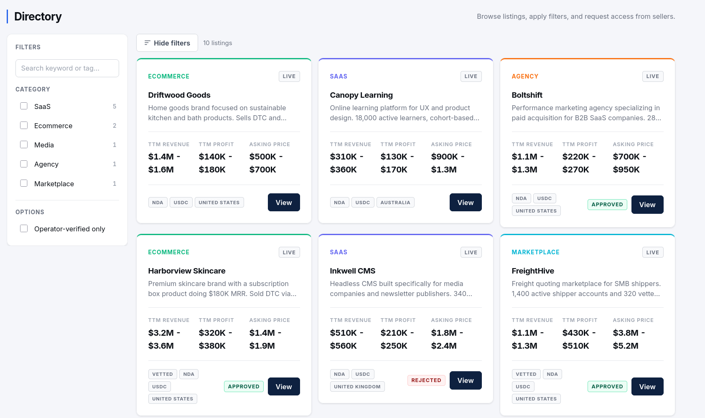
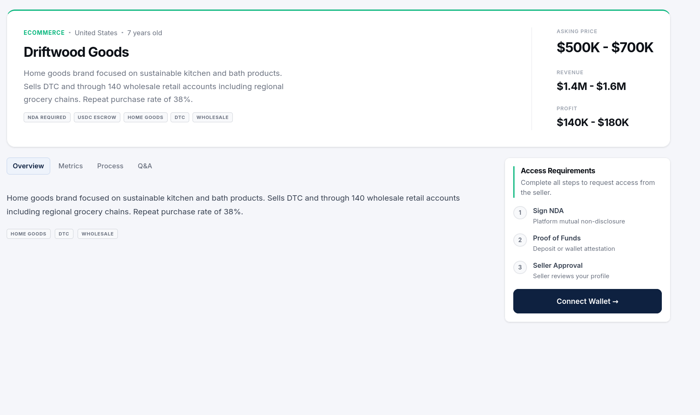
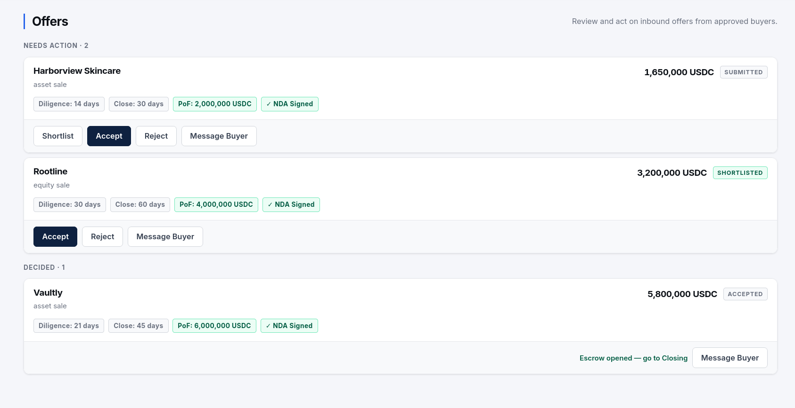
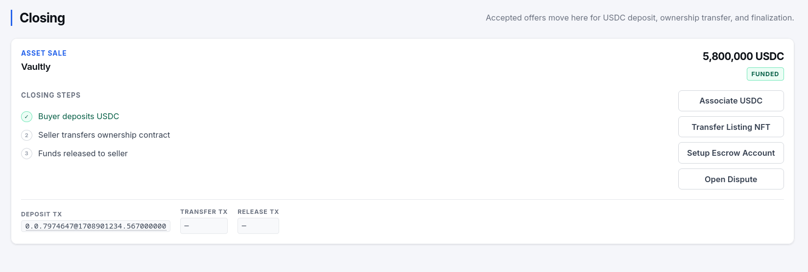
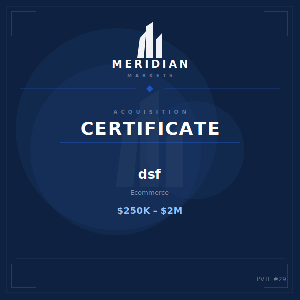
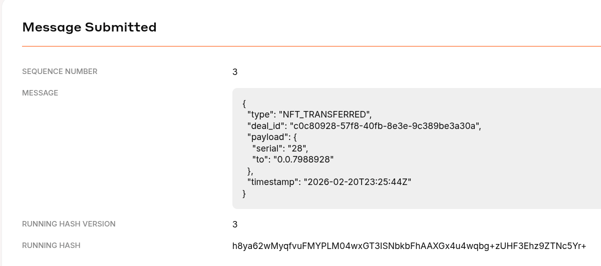

<p align="center">
  
</p>

<p align="center">
  A private marketplace for online business acquisitions with verified listings, NDA-gated data rooms, and USDC escrow settlement on the Hedera network.
</p>

---

## Overview

Meridian Directory is a marketplace platform that handles the complete lifecycle of an online business acquisition:

1. **Sellers** list businesses with anonymised teasers and gated financial data
2. **Buyers** request access, sign NDAs, and submit offers
3. **Escrow** accepted offers move into a 2-of-3 threshold Hedera escrow account (buyer + seller + platform), funded with USDC
4. **Closing** once the seller transfers the listing ownership NFT, the buyer co-signs a Hedera Scheduled Transaction to release funds; every milestone is written to an immutable HCS audit topic
5. **Settlement** USDC lands in the seller's wallet; the buyer holds the acquisition certificate NFT

---

## Screenshots

| | |
|---|---|
|  |  |
| **Listings board** | **Listing detail & data room** |

| | |
|---|---|
|  |  |
| **Offers board** | **Closing / escrow room** |

| | |
|---|---|
|  |  |
| **Acquisition certificate NFT** | **On-chain audit trail** |

---

## Architecture

```
meridian/
├── api/          # Go REST API (Gin, PostgreSQL, Hedera SDK)
│   ├── cmd/
│   │   └── setup/    # One-time testnet initialisation script
│   ├── config/       # Environment-based configuration
│   ├── db/           # Schema auto-migration on startup
│   ├── handler/      # HTTP route handlers
│   ├── middleware/   # JWT auth
│   ├── model/        # Domain types
│   ├── router/       # Route registration
│   └── service/      # Hedera service wrapper
├── hedera/       # Hedera SDK package (escrow, HCS, NFT, mirror node)
└── web/          # React frontend (Vite, React Router, HashPack wallet)
```

### Tech stack

| Layer | Technology |
|---|---|
| API | Go 1.26, Gin, pgx v5 |
| Database | PostgreSQL 18.1 |
| Blockchain | Hedera Hashgraph (HTS, HCS, Scheduled Transactions) |
| Wallet | HashPack via WalletConnect |
| Frontend | React 18, Vite, React Router v6 |
| Auth | JWT (HS256) |

### Hedera components

| Component | Purpose |
|---|---|
| **HTS USDC** | Fungible token used for escrow deposits and settlement |
| **Escrow account** | Per-deal Hedera account with a 2-of-3 threshold key (buyer + seller + platform) |
| **Scheduled Transaction** | Platform creates the release transfer; buyer co-signs to execute |
| **HCS topic** | Immutable per-deal audit trail (`ESCROW_CREATED` → `DEAL_CLOSED`) |
| **Listing NFT** | Non-fungible token (HIP-412) representing ownership; transferred to buyer at close |

---

## Prerequisites

- **Go** 1.22+
- **Node.js** 20+ and npm
- **Docker** (for PostgreSQL)
- A **Hedera testnet** operator account and private key — create one free at [portal.hedera.com](https://portal.hedera.com)
- A **WalletConnect** project ID — create one free at [cloud.walletconnect.com](https://cloud.walletconnect.com)
- **HashPack** wallet browser extension (for wallet interactions)

---

## Setup

### 1. Clone and enter the repo

```bash
git clone <repo-url>
cd meridian
```

### 2. Configure the API

```bash
cp api/.env.example api/.env
```

Edit `api/.env` and fill in your Hedera operator credentials at minimum:

```env
HEDERA_OPERATOR_ACCOUNT_ID=0.0.XXXXX
HEDERA_OPERATOR_PRIVATE_KEY=302e...
```

See the [full API env reference](#api-environment-variables) below.

### 3. Start PostgreSQL

```bash
cd api
make up
```

### 4. Run the one-time setup script

This creates the test USDC token and NFT collection on testnet, generates buyer/seller Hedera accounts, and seeds the database with test users.

```bash
make setup
```

The script prints the generated token IDs and test credentials. Copy the two token IDs it outputs back into `api/.env`:

```env
HEDERA_USDC_TOKEN_ID=0.0.XXXXX
HEDERA_NFT_COLLECTION_ID=0.0.XXXXX
```

### 5. Start the API

```bash
make run
# API listening on :8080
```

The schema is applied automatically on first start.

### 6. Configure and start the frontend

```bash
cd ../web
cp .env.example .env
```

Edit `web/.env`:

```env
VITE_API_URL=http://localhost:8080
VITE_WALLETCONNECT_PROJECT_ID=<your-walletconnect-project-id>
VITE_HEDERA_USDC_TOKEN_ID=<same as HEDERA_USDC_TOKEN_ID above>
VITE_HEDERA_NFT_COLLECTION_ID=<same as HEDERA_NFT_COLLECTION_ID above>
VITE_HEDERA_NETWORK=testnet
VITE_HEDERA_POF_ACCOUNT_ID=<your operator account ID>
```

```bash
npm install
npm run dev
# Frontend at http://localhost:5173
```

---

## Test accounts

After `make setup`, three accounts are seeded (password for all: **`Test1234!`**):

| Email | Role | Notes |
|---|---|---|
| `buyer@meridian.test` | Buyer | Funded with 500,000 test USDC |
| `seller@meridian.test` | Seller | Can create listings |
| `operator@meridian.test` | Operator | Admin panel, can force-complete releases |

To pair a test account with HashPack for wallet interactions, import the printed private key into HashPack when prompted to link a wallet.

---

## Deal flow

```
Seller creates listing
        │
        ▼
Buyer requests access  ──►  Seller approves / denies
        │ (approved)
        ▼
Buyer submits offer  ──►  Seller accepts
        │ (accepted)
        ▼
Escrow provisioned (2-of-3 threshold Hedera account)
        │
        ▼
Buyer deposits USDC  ──►  escrow status: funded
        │
        ├──►  Seller associates USDC (one-time)
        │
        ▼
Seller transfers listing NFT to buyer
        │
        ▼
Buyer clicks "Release Funds"
  Platform signs schedule (1/3)  ──►  Buyer co-signs via HashPack (2/3)
        │                              (threshold met → USDC sent on-chain)
        ▼
completeRelease verifies execution  ──►  escrow status: completed
```

Every stage from escrow creation through deal close is written to the deal's HCS topic as an immutable audit record.

---

## NFT certificates

Each listing mints a unique **Acquisition Certificate NFT** (HIP-412) at listing creation time. The NFT metadata and a generated 600×600 SVG image are served by the API:

```
GET /api/v1/nft/metadata/:listingId   →  HIP-412 JSON
GET /api/v1/nft/image/:listingId      →  image/svg+xml
```

Both endpoints are public (no auth) so wallets and explorers can fetch them. The image uses the Meridian brand palette and embeds the listing name, category, asking range, and a verified badge.

---

## API environment variables

| Variable | Required | Default | Description |
|---|---|---|---|
| `DATABASE_URL` | Yes | — | PostgreSQL connection string |
| `JWT_SECRET` | Yes | — | Secret for signing JWTs |
| `HEDERA_OPERATOR_ACCOUNT_ID` | Yes | — | Platform Hedera account (e.g. `0.0.12345`) |
| `HEDERA_OPERATOR_PRIVATE_KEY` | Yes | — | Platform Ed25519 private key (DER hex) |
| `HEDERA_USDC_TOKEN_ID` | Yes | — | HTS USDC token ID |
| `HEDERA_NFT_COLLECTION_ID` | No | — | HTS NFT collection token ID |
| `HEDERA_NETWORK` | No | `testnet` | `testnet` or `mainnet` |
| `APP_BASE_URL` | No | `http://localhost:8080` | Public API URL used in NFT metadata image links |
| `APP_PORT` | No | `8080` | HTTP listen port |

---

## Frontend environment variables

| Variable | Required | Description |
|---|---|---|
| `VITE_API_URL` | Yes | Base URL of the Go API |
| `VITE_WALLETCONNECT_PROJECT_ID` | Yes | WalletConnect cloud project ID |
| `VITE_HEDERA_USDC_TOKEN_ID` | Yes | HTS USDC token ID (same as API) |
| `VITE_HEDERA_NETWORK` | Yes | `testnet` or `mainnet` |
| `VITE_HEDERA_POF_ACCOUNT_ID` | Yes | Platform account for proof-of-funds deposits |
| `VITE_HEDERA_NFT_COLLECTION_ID` | No | HTS NFT collection token ID |

---

## Makefile reference (api/)

```bash
make up        # Start PostgreSQL in Docker
make down      # Stop and remove containers
make db-reset  # Wipe and recreate the database
make setup     # One-time testnet initialisation (creates tokens, seeds users)
make run       # Start the API server
make build     # Compile to bin/api
```

---

## Production build

**API:**
```bash
cd api
make build
./bin/api
```

**Frontend:**
```bash
cd web
npm run build
# Output in web/dist/ — serve with any static file host
```
